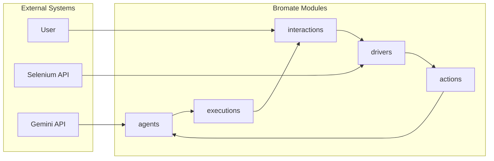

```mermaid
graph LR
    subgraph "Bromate Modules"
        A[agents] --> B[executions]
        B[executions] --> C[interactions]
        C[interactions] --> D[drivers]
        D[drivers] --> E[actions]
        E[actions] --> A[agents]
    end

    subgraph "External Systems"
        H[User] --> C[interactions]
        I[Selenium API] --> D[drivers]
        J[Gemini API] --> A[agents]
    end
```
